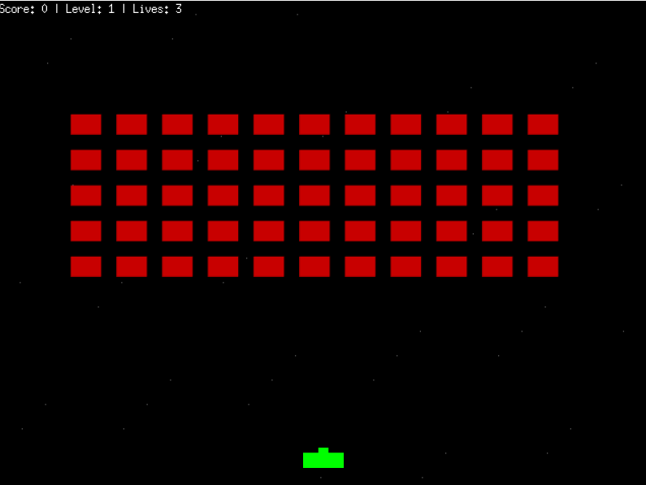
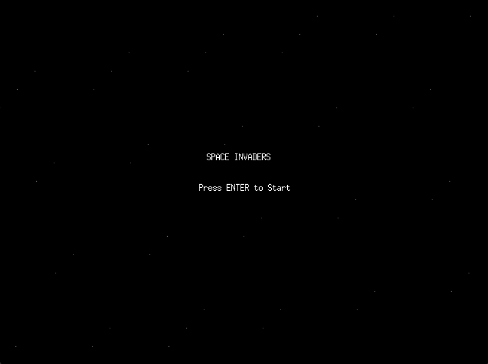

# Space Invaders
A classic Space Invaders game built with GoLang and the Ebitengine game engine.




## Features
- Classic arcade gameplay
- Multiple levels with increasing difficulty
- Animated aliens and starfield background
- Score tracking and lives system
- Smooth player controls

## How to Play
- **Left/Right Arrow** or **A/D**: Move the ship
- **Space** or **W**: Shoot
- **Enter**: Start game or proceed to next level
- **R**: Restart game after Game Over or Win

## Development Concepts Explored
- **Game Loop**: Understanding the Update/Draw cycle.
- **Entity Management**: Handling multiple game objects (player, aliens, bullets).
- **Collision Detection**: Simple AABB (Axis-Aligned Bounding Box) collision.
- **Game States**: Managing Title, Playing, Level Clear, and Game Over states.
- **Graphics**: Using vector drawing and color manipulation for visuals.

## Prerequisites
- Go 1.22+
- CGO dependencies (for default build) or `ebitenginepurego` tag.

## Building and Running
To build the game:
```bash
go build -tags=ebitenginepurego -o space-invaders main.go
```

To run the game:
```bash
./space-invaders
```

### Project Structure

- `main.go` - Entry point and main game loop
- `entities/` - Player, aliens, and bullet entities
- `game/` - Game state management
- `collision/` - Collision detection logic
